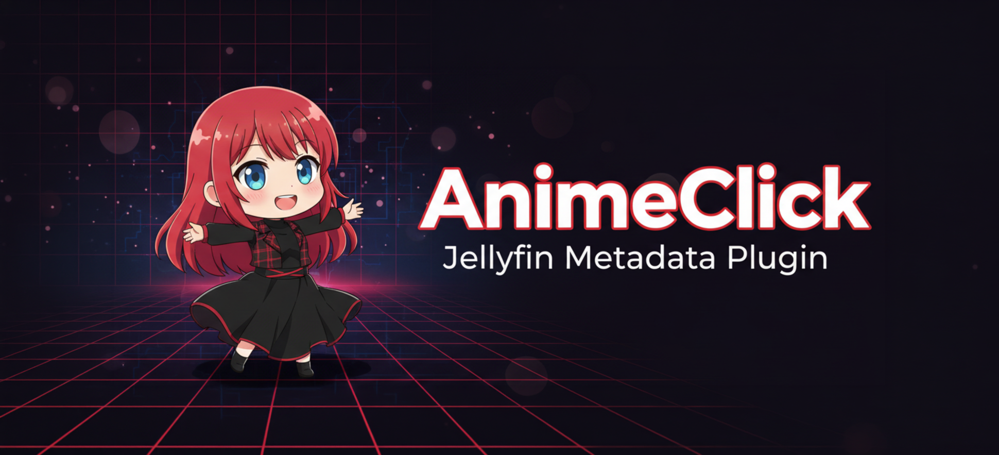

<!-- Nota per chi manutiene: qui non si scrivono numeri di versione. Il badge in cima legge
     l'ultima release e i link puntano a /releases/latest, quindi il README va aggiornato quando
     cambiano funzioni, requisiti o procedure, non a ogni rilascio. -->

<div align="center">
  

  # AnimeClick Metadata Plugin for Jellyfin

  [](https://github.com/iCosiSenpai/jellyfin-plugin-animeclick/releases/latest)
  [](https://raw.githubusercontent.com/iCosiSenpai/iCosiSenpai-Plugins/main/manifest.json)
  [](https://jellyfin.org/)
  [](https://github.com/iCosiSenpai/jellyfin-plugin-animeclick/actions/workflows/build.yml)

  [](https://github.com/iCosiSenpai/jellyfin-plugin-animeclick/releases)
  [](https://github.com/iCosiSenpai/jellyfin-plugin-animeclick/releases/latest)
  [](https://dotnet.microsoft.com/)
  [](LICENSE)
</div>

Porta in Jellyfin i metadati italiani degli anime presenti su [AnimeClick.it](https://www.animeclick.it/): titoli, trame, generi, cast, staff e informazioni sugli episodi.

Il plugin segue una regola semplice: **usa AnimeClick quando possiede un dato italiano affidabile e lascia agli altri provider i campi mancanti**. Se un abbinamento non è sicuro, preferisce non modificare l'episodio invece di assegnare informazioni sbagliate.

> **Nota**: Questo plugin utilizza scraping etico del sito AnimeClick, autorizzato dallo staff. Tutte le richieste sono rate-limited e i dati vengono cacheati localmente.

<details>
<summary><b>In English</b></summary>

A Jellyfin metadata provider that fills Italian titles, plots, genres, cast, staff and episode information for anime from [AnimeClick.it](https://www.animeclick.it/), with optional TheTVDB, TMDB and AI translation as fallbacks for episode synopses. It writes a field only when the match is provable, and leaves the episode untouched otherwise — no metadata beats plausible wrong metadata.

The documentation below is in Italian, like the metadata the plugin produces. Scraping is authorised by the AnimeClick staff for non-commercial use, rate-limited and cached locally.

</details>


## Indice

- [Cosa fa](#cosa-fa) · [Requisiti](#requisiti) · [Installazione](#installazione) · [Configurazione](#configurazione)
- [Episodi: titoli, sinossi e numerazioni](#episodi-titoli-sinossi-e-numerazioni)
- [Traduzione AI, opzionale](#traduzione-ai-opzionale)
- [Manutenzione: la scheda Libreria](#manutenzione-la-scheda-libreria)
- [Strumenti e diagnostica](#strumenti-e-diagnostica) · [Sviluppo](#sviluppo) · [Risoluzione dei problemi](#risoluzione-dei-problemi)
- [Scraping autorizzato e uso corretto](#scraping-autorizzato-e-uso-corretto) · [Fonti](#fonti-e-riconoscimenti) · [Licenza](#licenza)

## Cosa fa

Il plugin si registra su serie, stagioni, episodi, film e persone, e riempie questi campi:

| Campo | Fonte | Note |
|---|---|---|
| Titolo italiano | AnimeClick | Il titolo originale viene conservato nel campo *Titolo originale* |
| Trama | AnimeClick | |
| Generi, tag, origine, nazionalità | AnimeClick | |
| Cast e staff | AnimeClick | Con le immagini delle persone quando esistono |
| Studi, valutazione, collezioni | AnimeClick | |
| Trailer e PV | AnimeClick | |
| Sigle | AnimeClick | Aggiunte come tag `OP1: …`, `ED1: …` con l'interprete |
| Titoli degli episodi | AnimeClick | |
| Sinossi degli episodi | AnimeClick, poi TheTVDB e TMDB | Le fonti esterne sono opzionali, vedi [la catena](#lordine-delle-fonti) |
| Locandina | AnimeClick | Solo come riserva, vedi [l'ordine dei provider](#lordine-dei-provider-conta) |

Le voci principali si possono spegnere una per una nella scheda **Metadati**, se preferisci che un campo lo riempia un altro provider.

### Cosa non tocca, di proposito

- **La durata degli episodi**: quella misurata da Jellyfin sul file è più precisa di quella dichiarata da una scheda, e sovrascriverla peggiorerebbe il dato.
- **I campi bloccati**: un lock in Jellyfin viene sempre rispettato.
- **I commenti degli utenti**: non diventano mai una sinossi.
- **Gli episodi con un abbinamento incerto**: restano intatti. Nessun metadato è preferibile a un metadato plausibile e sbagliato.

## Requisiti

- Jellyfin **10.11.x**. La versione pubblicata nel catalogo e l'ABI su cui è compilata sono i due badge in cima a questa pagina: vengono letti in diretta dal manifest, quindi non possono restare indietro rispetto alla realtà.
- Nessuna API key per i dati che stanno su AnimeClick.
- Facoltativo, solo per allargare la copertura delle sinossi episodio: una chiave [TMDB](https://developer.themoviedb.org/docs/getting-started), una [TheTVDB](https://thetvdb.com/dashboard), un [servizio AI](#traduzione-ai-opzionale).

## Installazione

### Dal catalogo (consigliato)

1. In Jellyfin apri **Dashboard → Plugin → Repository**.
2. Aggiungi questo indirizzo:

   ```text
   https://raw.githubusercontent.com/iCosiSenpai/iCosiSenpai-Plugins/main/manifest.json
   ```

3. Apri il catalogo, cerca **AnimeClick Metadata** e installalo.
4. Riavvia Jellyfin.

Gli aggiornamenti successivi compaiono in **Dashboard → Plugin**. Le impostazioni salvate, comprese le API key, sopravvivono all'aggiornamento: sono conservate fuori dalla cartella del plugin.

### Manuale

Serve solo se il catalogo non è raggiungibile.

1. Scarica `AnimeClick.Plugin.zip` dalla [release più recente](https://github.com/iCosiSenpai/jellyfin-plugin-animeclick/releases/latest).
2. Ferma Jellyfin.
3. Crea nella cartella dei plugin una directory `AnimeClick Metadata_<VERSIONE>` ed estraici il contenuto dello ZIP.
4. Riavvia Jellyfin e controlla la versione nella pagina del plugin.

Percorsi comuni: `/config/plugins/` (Docker), `~/.local/share/jellyfin/plugins/` (Linux), `%APPDATA%\jellyfin\plugins\` (Windows).

> **Una versione per volta.** Due cartelle `AnimeClick Metadata_*` contemporaneamente entrano in conflitto: sposta la vecchia fuori dalla directory dei plugin, non lasciarla accanto alla nuova.

Per tornare indietro: ferma Jellyfin, rimuovi la cartella nuova, rimetti quella precedente, riavvia. Le differenze fra le versioni sono nelle [release](https://github.com/iCosiSenpai/jellyfin-plugin-animeclick/releases).

## Configurazione

### L'ordine dei provider conta

Nelle impostazioni della libreria anime (**Dashboard → Librerie → la tua libreria → Gestisci**):

- **Metadati: AnimeClick per primo.** È la fonte italiana, e i valori che produce vengono riapplicati dopo la fusione dei provider, così un provider successivo non li sovrascrive con l'inglese.
- **Immagini: AnimeClick per ultimo.** Le locandine di AnimeClick sono più piccole di quelle di TMDB o Fanart: servono come riserva quando gli altri non trovano niente.

La scheda **Panoramica** del plugin mostra, libreria per libreria, in che posizione si trova davvero: è il modo più rapido per accorgersi che l'ordine non è quello che si crede.

### Le schede della pagina di configurazione

| Scheda | A cosa serve |
|---|---|
| **Panoramica** | Stato dei provider, delle chiavi e dell'ordine effettivo in ogni libreria |
| **Metadati** | Quali campi AnimeClick può scrivere, e la locandina di riserva |
| **Sinossi episodi** | La catena delle sinossi, le chiavi esterne e il [servizio AI](#traduzione-ai-opzionale) |
| **Libreria** | [Analisi della copertura dei titoli](#manutenzione-la-scheda-libreria) e ricontrollo immediato |
| **Strumenti** | [Identificazione manuale, cache, override e diagnostica](#strumenti-e-diagnostica) |

### Uso minimo

Installare, mettere AnimeClick per primo, aggiornare i metadati. Nient'altro: senza alcuna chiave il plugin usa solo AnimeClick, e per la maggior parte delle serie è già tutto quello che serve. Attiva **Sinossi episodi** se vuoi anche le descrizioni delle singole puntate.

## Episodi: titoli, sinossi e numerazioni

Titolo e sinossi sono due dati indipendenti, con fonti e regole diverse.

### Il titolo

Viene letto dalla lista episodi di AnimeClick. Un nome generico — `Episodio 12`, `Episode 12`, `Ep. 12`, `Puntata 5` — non è un titolo: il plugin lo ignora e lascia il campo agli altri provider, invece di scrivere un numero travestito da titolo.

### La sinossi

Viene letta dalla pagina della singola puntata, e solo dalla descrizione editoriale: un campo vuoto o un segnaposto vengono ignorati, i commenti degli utenti non vengono mai usati. Una frase reale non viene scartata solo perché contiene la parola «episodio»: il filtro scatta quando *tutto* il testo è un segnaposto.

#### L'ordine delle fonti

Con **Sinossi episodi** attivo, il plugin prova nell'ordine e si ferma al primo risultato valido:

| # | Fonte | Cosa cerca | Serve una chiave |
|---:|---|---|---|
| 1 | AnimeClick | Sinossi italiana della pagina episodio | no |
| 2 | TheTVDB `ita` | Sinossi italiana già pronta | TheTVDB |
| 3 | TMDB `it-IT` | Sinossi italiana già pronta | TMDB |
| 4 | TMDB `en-US` | Sinossi inglese da tradurre | TMDB |
| 5 | TheTVDB `eng` | Seconda possibilità in inglese | TheTVDB |
| 6 | Traduzione AI | Traduce in italiano il testo trovato ai punti 4 e 5 | [servizio AI](#traduzione-ai-opzionale) |

Le sinossi italiane già scritte da un essere umano vengono prima di qualunque traduzione automatica. Se nessuna fonte produce un testo valido, il campo resta invariato.

### Numerazioni gestite

Le pagine AnimeClick e le cartelle Jellyfin non dividono sempre una serie nello stesso modo. Il plugin confronta le informazioni disponibili e gestisce, tra gli altri, questi casi:

| Caso | Comportamento |
|---|---|
| Una lista continua di episodi | Ricostruisce l'ordine senza supporre stagioni inesistenti |
| Stagioni separate o numerazione che riparte da 1 | Abbina la puntata alla stagione corretta |
| Stagioni di lunghezza diversa, ad esempio 13 + 11 | Usa i confini reali della libreria quando sono disponibili |
| Una sola stagione Jellyfin che unisce più gruppi AnimeClick | Segue l'ordine complessivo quando i numeri lo confermano |
| Episodio 0, OVA, OAV, OAD, ONA, special, recap, bonus, extra | Li tiene separati dagli episodi normali |
| Extra numerati dopo la fine della serie (`Ep. 25 (extra)`) | Li abbina ai file che la libreria tiene come episodi 25 e 26 |
| Uno spin-off elencato nella stessa tabella | Lo riconosce dall'etichetta e non gli lascia rubare la numerazione |
| Numeri come `12.5`, `12A`, `12B` | Non li forza su E12 senza prove sufficienti |
| Un file che contiene E01-E02 | Lo abbina soltanto a un intervallo compatibile |
| Numeri duplicati o dati contraddittori | Lascia l'episodio intatto finché il match non è sicuro |

Special e OVA non fanno slittare i titoli delle puntate normali.

### Quando una stagione sta su un'altra scheda

AnimeClick pubblica quasi ogni franchise come **una scheda per cour**: la seconda stagione di una serie è spesso una pagina separata, con i suoi episodi numerati da 1. Il plugin risale la catena dei sequel da sé, e nella maggior parte dei casi la trova.

Quando la catena non è dimostrabile — relazioni ambigue, remake con lo stesso titolo, anni che non tornano — preferisce non indovinare. In quel caso apri la stagione in Jellyfin e scrivi l'ID AnimeClick di quel cour nel campo **AnimeClick** della stagione: ha la precedenza sulla serie per il riconoscimento degli episodi, mentre le sinossi continuano a seguire la serie. La scheda **Libreria** ti dice esattamente per quali stagioni serve.

## Traduzione AI, opzionale

### Come funziona

Se una sinossi esiste **soltanto in inglese**, il plugin può tradurla. Non fa altro:

- non traduce i titoli degli episodi;
- non inventa trame;
- non viene chiamata se una sinossi italiana esiste già;
- costa una richiesta per sinossi, una volta sola nella vita: il risultato resta in cache per anni, e viene invalidato solo se cambia il testo di partenza, il modello o l'endpoint.

La traduzione non blocca la scansione della libreria, e questo ha una conseguenza visibile: **il primo aggiornamento avvia la traduzione, un aggiornamento successivo la applica.** Se la sinossi non compare subito, attendi e aggiorna di nuovo quell'episodio.

### Servizi disponibili

Si scelgono da un menu nella scheda **Sinossi episodi**.

| Servizio | Chiave | Note |
|---|---|---|
| Ollama Cloud | sì | Modelli con suffisso `-cloud`; uno per volta sul piano gratuito |
| Ollama in casa | no | Nessuna quota; se il demone ha già fatto `ollama signin`, l'abbonamento lo usa lui |
| OpenAI | sì | Chiave della piattaforma API, a consumo |
| Anthropic Claude | sì | Chiave della console, a consumo |
| Google Gemini | sì | Endpoint compatibile OpenAI ufficiale, con un piano gratuito a limiti |
| Mistral | sì | Buona resa sulle lingue europee |
| Groq | sì | Molto rapido quando le sinossi da tradurre sono tante |
| DeepSeek | sì | Tra i più economici sui testi brevi |
| OpenRouter | sì | Una sola chiave per i modelli di molti fornitori |
| Together AI | sì | Modelli aperti ospitati |
| xAI Grok | sì | Chiave della console xAI |
| LM Studio in casa | no | Server locale di LM Studio |
| Personalizzato | opzionale | Qualunque endpoint compatibile OpenAI: LiteLLM, vLLM, llama.cpp, un proxy aziendale |

Il **modello non ha un valore predefinito**, ed è voluto: i fornitori ritirano e rinominano i modelli continuamente, e un default scaduto diventa «la traduzione ha smesso di funzionare senza dire niente». Il pulsante **Elenca modelli** chiede la lista al servizio con la tua chiave, così è sempre quella vera.

### Configurazione

1. **Dashboard → Plugin → AnimeClick Plugin → Sinossi episodi**.
2. Attiva **Sinossi degli episodi** e configura TMDB, TheTVDB o entrambi: senza una fonte inglese non c'è niente da tradurre.
3. Scegli il **Servizio AI**. Endpoint e link per creare la chiave si compilano da sé.
4. Incolla la **API key**, se il servizio ne richiede una.
5. Premi **Elenca modelli** e scegli il **Modello**.
6. Salva, poi verifica: prima TMDB o TheTVDB, quindi **Verifica AI**.
7. Prova una traduzione nell'anteprima e aggiorna un episodio.

### Un servizio in casa

Un endpoint sulla tua rete è ammesso anche in HTTP semplice — `http://ollama:11434/api/chat`, `http://nas.local:11434/api/chat`, un indirizzo privato della LAN — perché pretendere TLS avrebbe voluto dire un certificato per un indirizzo di rete locale, cioè nessuna opzione locale.

Verso un host pubblico l'HTTPS resta obbligatorio, e **la chiave non viaggia mai in chiaro**: se ne hai configurata una e l'endpoint è HTTP, viene scartata con un avviso nel log invece di essere spedita.

### Perché non c'è il «login con ChatGPT» o «login con Claude»

Usare un abbonamento già pagato sarebbe comodo, ma non è permesso:

- l'abbonamento ChatGPT [non include l'accesso all'API](https://help.openai.com/en/articles/6950777-what-is-chatgpt-plus), fatturata a parte. «Sign in with ChatGPT» esiste, ma copre i client Codex, non le chiamate API di altri programmi;
- Anthropic ha [chiarito nei termini di servizio](https://www.theregister.com/2026/02/20/anthropic_clarifies_ban_third_party_claude_access/) che i token OAuth dei piani Free, Pro e Max valgono solo per Claude Code e Claude.ai: usarli altrove viola le condizioni d'uso.

Esistono progetti che aggirano il vincolo riusando le credenziali dei client ufficiali. Questo plugin non lo fa: metterebbe a rischio l'account di chi lo installa e si romperebbe al primo cambiamento lato fornitore.

L'unico modo legittimo per non tenere una chiave dentro Jellyfin è far custodire le credenziali a un servizio in casa — Ollama con `ollama signin`, o un gateway come LiteLLM — e puntare il plugin a quello.

### Privacy e costi

Al servizio scelto vengono inviati la sinossi inglese, le istruzioni di traduzione e il nome del modello. Non vengono inviati video, file della libreria o credenziali Jellyfin.

La chiave è salvata nella configurazione di Jellyfin: proteggi quella cartella e i suoi backup. Disponibilità dei modelli, limiti e costi dipendono dal servizio e cambiano nel tempo: controlla il tuo account.

## Manutenzione: la scheda Libreria

Un titolo assente sembra identico qualunque ne sia la causa, ma le cause chiedono reazioni opposte: una si risolve con un pulsante, una si sistemerà da sé, una è una lacuna della fonte che nessun aggiornamento colmerà. La scheda **Libreria** le distingue leggendo soltanto le schede già in cache, quindi **l'analisi non produce nessuna richiesta ad AnimeClick**.

| Diagnosi | Che cosa significa | Cosa fare |
|---|---|---|
| Completa | Ogni episodio ha un titolo | Niente |
| Basta un ricontrollo | Il titolo è già su AnimeClick, Jellyfin non l'ha ancora scritto | **Esegui ora il ricontrollo** |
| Titolo non pubblicato | Episodio abbinato, titolo italiano non ancora uscito | Attendere: ci pensa il ricontrollo settimanale |
| Scheda senza titoli | AnimeClick elenca gli episodi senza titolo | Nulla da recuperare, non è un difetto del plugin |
| Numerazione ripetuta | La scheda ripete gli stessi numeri | Segnalare la serie |
| Riga scomparsa | L'identità salvata punta a una riga che non c'è più | **Svuota cache** su quella serie |
| Scheda di stagione da indicare | La stagione sta su un'altra scheda e la catena non è dimostrabile | [Scrivere l'ID nella stagione](#quando-una-stagione-sta-su-unaltra-scheda) |
| Nessuna identità | Nessun abbinamento scritto su quell'episodio | **Esegui ora il ricontrollo**; se resiste, segnalare |
| Non identificata | La serie non ha un ID AnimeClick | Identificarla |

Per ogni serie: **Analizza** rilegge la scheda dal sito e rifà la ricerca della stagione, per un verdetto definitivo; **Svuota cache** invalida solo le schede di quella serie; per una serie non identificata un pulsante ne porta l'ID nella scheda Strumenti.

### Il ricontrollo dei titoli

AnimeClick pubblica la riga di un episodio il giorno in cui va in onda e ne aggiunge il titolo italiano dopo. Jellyfin, però, rinfresca un episodio solo quando ne cambia il file: il titolo pubblicato tre giorni più tardi non arriverebbe mai.

Se ne occupa l'attività pianificata **«AnimeClick: ricontrolla i titoli episodio mancanti»**, che gira ogni sette giorni e accoda fino a duecento episodi per volta, scegliendo quelli che un ricontrollo può davvero sistemare e saltando le schede che non pubblicano titoli. Puoi lanciarla subito dalla scheda **Libreria** o da **Dashboard → Attività pianificate**.

## Strumenti e diagnostica

Nella scheda **Strumenti**:

- **Identifica e aggiorna** — associa un elemento Jellyfin a un ID AnimeClick e lancia il refresh.
- **Svuota la cache** — tutta, o solo quella di una serie dalla scheda Libreria. Serve quando AnimeClick corregge una pagina e vuoi rileggerla prima della scadenza naturale.
- **Override del layout episodi** — un fail-safe per serie con una struttura eccezionale (`ID=flat`, `ID=explicit`, `ID=13,24`). Da usare solo dopo aver verificato il caso: un override sbagliato impedisce un abbinamento che il riconoscimento automatico avrebbe risolto.
- **Ricerca, rete e compatibilità** — numero di risultati, durata della cache, pausa fra le richieste, URL base, User-Agent.

Le verifiche di connessione di TMDB, TheTVDB e del servizio AI, l'anteprima di traduzione e la prova della catena completa su un episodio reale stanno nelle rispettive schede. Tutte richiedono un account amministratore.

### API di diagnostica

Gli stessi strumenti sono raggiungibili via HTTP, se preferisci gli script all'interfaccia. Tutti gli endpoint richiedono un token di amministratore (`Authorization: MediaBrowser Token="…"`) e vivono sotto `/Plugins/AnimeClick`.

| Metodo | Endpoint | A cosa serve |
|---|---|---|
| `GET` | `TestLookup?name=&year=` | Cosa risponde la ricerca per un titolo |
| `GET` | `TestEpisodes?animeClickId=&season=&episode=` | La tabella episodi come la legge il plugin, con la strategia di abbinamento usata |
| `GET` | `LibraryAudit` | Analisi della copertura dei titoli, solo da cache |
| `POST` | `LibraryAuditSeries` | Rilettura e verdetto definitivo per una serie |
| `POST` | `RunMissingTitlesTask` | Avvia subito il ricontrollo dei titoli |
| `GET` | `AiProviders` | I servizi AI selezionabili |
| `POST` | `AiModels` | I modelli che la tua chiave può usare |
| `POST` | `TestAi` · `TestTmdb` · `TestTvdb` | Prova di connessione, senza mai restituire le credenziali |
| `POST` | `PreviewTranslation` | Traduce un testo con il profilo corrente |
| `POST` | `PreviewEpisodeFallback` | Esegue la catena reale su un episodio e dice quale fonte ha vinto |
| `POST` | `IdentifyAndRefresh` | Associa un ID AnimeClick a un elemento e lo aggiorna |
| `POST` | `ClearCache` | Tutta la cache, o solo una serie con `{"animeClickId":"…"}` |

## Sviluppo

```bash
git clone https://github.com/iCosiSenpai/jellyfin-plugin-animeclick.git
cd jellyfin-plugin-animeclick
dotnet build AnimeClick.Plugin.csproj -c Release
dotnet test AnimeClick.Plugin.Tests/AnimeClick.Plugin.Tests.csproj -c Release
```

Serve l'SDK .NET 9. La build non deve produrre warning e la suite non deve avere test rossi: la CI verifica entrambe le cose, più che ogni numero di versione scritto a mano nel progetto coincida con `<Version>`.

| Cartella | Contenuto |
|---|---|
| `Providers/` | I provider Jellyfin per serie, stagioni, episodi, film, immagini e ID esterni |
| `Services/` | Scraping, parsing, abbinamento episodi, cache, client TMDB/TheTVDB, traduzione AI |
| `Api/` | Gli endpoint di diagnostica e di identificazione |
| `Tasks/` | L'attività pianificata di ricontrollo dei titoli |
| `Configuration/`, `Web/` | La pagina di configurazione: HTML, CSS e JavaScript |
| `tools/AnimeClick.Harness/` | Strumento offline: confronta la libreria Jellyfin con ciò che il plugin scriverebbe, senza toccarla |

L'harness è il modo più efficace per trovare difetti reali: legge la libreria in sola lettura, esegue la stessa logica di abbinamento e produce un referto delle differenze. Diversi difetti chiusi nelle ultime versioni sono stati trovati così, non leggendo il codice.

### Segnalazioni

Un caso reale vale più di una descrizione generica. Nella [segnalazione](https://github.com/iCosiSenpai/jellyfin-plugin-animeclick/issues) indica l'indirizzo AnimeClick della serie, stagione ed episodio come li mostra Jellyfin, il nome del file senza percorsi personali, il risultato atteso e i log ripuliti dai dati sensibili.

## Risoluzione dei problemi

**La serie non viene trovata.** Controlla che AnimeClick sia abilitato in quella libreria e che Jellyfin raggiunga `animeclick.it`. Se il titolo è insolito, cerca la serie su AnimeClick e identificala a mano con il numero che compare nel suo indirizzo.

**Il titolo di un episodio resta vuoto.** Apri **Libreria → Analizza la libreria**: dice quale causa è in gioco invece di farti indovinare. Le più frequenti sono una scheda che elenca gli episodi senza titolo — e allora non c'è niente da recuperare — o una numerazione ambigua, davanti alla quale il plugin lascia il campo invariato di proposito.

**La sinossi non compare.** Controlla che **Sinossi episodi** sia attivo, esegui le verifiche delle chiavi che usi, e prova la catena completa dalla scheda Sinossi episodi. Se la fonte è inglese e usi la traduzione AI, aggiorna una seconda volta. Alcune puntate non hanno una sinossi in nessuna fonte.

**I titoli sono spostati.** Non forzare subito un override: apri una [segnalazione](https://github.com/iCosiSenpai/jellyfin-plugin-animeclick/issues) con l'indirizzo AnimeClick della serie, stagione ed episodio mostrati da Jellyfin, il nome del file senza percorsi personali, il risultato atteso e i log utili ripuliti dai dati sensibili.

**La locandina AnimeClick non viene usata.** È il comportamento previsto quando un provider precedente ha già trovato un'immagine migliore: AnimeClick è la riserva per le immagini.

## Scraping autorizzato e uso corretto

I metadati sono forniti da **AnimeClick.it**, gestito dall'associazione culturale no-profit Associazione NewType Media.

Questo plugin non è affiliato con AnimeClick. Lo scraping è stato autorizzato dallo staff di AnimeClick per uso non commerciale.

Per rispettare il sito e l'autorizzazione ricevuta, il plugin:

- limita la frequenza delle richieste;
- conserva localmente i risultati per evitare richieste ripetute;
- recupera soltanto le informazioni necessarie ai metadati;
- non importa i commenti degli utenti come contenuto editoriale;
- non deve essere usato per raccolte massive o finalità commerciali.

Se modifichi o riutilizzi il progetto, mantieni queste protezioni e rispetta le condizioni delle fonti coinvolte.

## Fonti e riconoscimenti

| Servizio | Ruolo nel plugin |
|---|---|
| [AnimeClick.it](https://www.animeclick.it/) | Fonte italiana principale, comprese le sinossi episodio quando presenti |
| [TheTVDB](https://thetvdb.com/) | Sinossi episodio italiane e inglesi, opzionale |
| [TMDB](https://www.themoviedb.org/) | Sinossi episodio italiane e inglesi, opzionale |
| [Ollama](https://ollama.com/) e gli altri servizi AI | Traduzione dall'inglese all'italiano, opzionale |

**TheTVDB:** Metadata provided by TheTVDB. Please consider adding missing information or [subscribing](https://thetvdb.com/subscribe).

This product uses the TMDB API but is not endorsed or certified by TMDB.

## Supporto e progetto

- [Segnala un problema o proponi un caso reale](https://github.com/iCosiSenpai/jellyfin-plugin-animeclick/issues)
- [Consulta le release](https://github.com/iCosiSenpai/jellyfin-plugin-animeclick/releases)
- [Sostieni il progetto su Buy Me a Coffee](https://buymeacoffee.com/iCosiSenpai)
- [Fai una donazione con PayPal](https://www.paypal.com/donate/?hosted_button_id=5A4E26XC45GLQ)

## Licenza

[GNU GPL v3](LICENSE)
