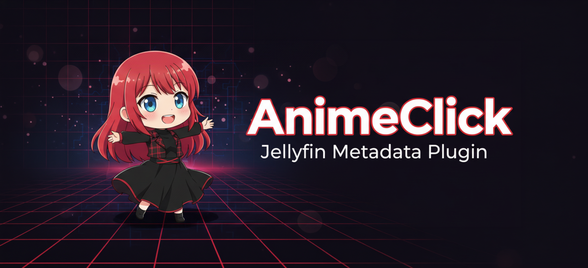

<div align="center">
  

  # AnimeClick Metadata per Jellyfin

  [](https://github.com/iCosiSenpai/jellyfin-plugin-animeclick/releases/latest)
  [](https://github.com/iCosiSenpai/jellyfin-plugin-animeclick/actions/workflows/build.yml)
  [](#compatibilità-e-aggiornamento)
  [](https://dotnet.microsoft.com/)
  [](LICENSE)
</div>

Titoli, trame e puntate degli anime in italiano, direttamente nella tua libreria Jellyfin.
La fonte principale è [AnimeClick.it](https://www.animeclick.it/): **non serve una chiave API per iniziare**.

Il plugin cerca un abbinamento verificabile fra il tuo titolo e la scheda AnimeClick. Se i dati sono ambigui, lascia il campo invariato e permette di correggere l’abbinamento. TMDB, TheTVDB e la traduzione AI sono integrazioni facoltative, non requisiti.

## Inizia da qui

1. In **Dashboard → Plugin → Repository**, aggiungi:

   ```text
   https://raw.githubusercontent.com/iCosiSenpai/iCosiSenpai-Plugins/main/manifest.json
   ```

2. Dal catalogo installa **AnimeClick Metadata** e riavvia Jellyfin.
3. Nelle impostazioni della tua libreria abilita AnimeClick: **primo fra i provider metadati, ultimo fra quelli delle immagini**.
4. Apri la pagina del plugin. **Inizio** mostra quali librerie lo usano; **La tua libreria** aiuta a trovare titoli e trame da completare.
5. Aggiorna i metadati di un titolo per provarlo.

Le normali impostazioni di Jellyfin continuano a contare: abilitazione per tipo di contenuto, ordine dei provider e blocchi dei metadati.

## Compatibilità e aggiornamento

La linea 1.x richiede **Jellyfin 12.0 o successivo**, con ABI minima `12.0.0.0` e .NET 10. La compatibilità è verificata su **12.0.0 e 12.1.0**, compilando contro entrambe le API e caricando la DLL compilata per 12.0 in entrambi i server. Le versioni future, soprattutto nuove major, richiedono ulteriori verifiche: “12+” non significa compatibilità binaria garantita per sempre.

Jellyfin 10.11 non può caricare questa major. Le release precedenti rimangono nel catalogo con la propria ABI; non installare manualmente la 1.x su un server 10.11.

Prima di aggiornare Jellyfin, segui le [indicazioni ufficiali per Jellyfin 12](https://jellyfin.org/posts/jellyfin-release-12.0/), compreso il backup di dati e configurazione. L’aggiornamento del plugin **non aggiorna il server**.

### Cosa conserva la major

- Identificativi e metadati già presenti nella libreria.
- Preferenze e chiavi salvate, comprese le configurazioni AI precedenti.
- Un’opzione già disabilitata resta disabilitata: le sinossi episodio sono attive per impostazione predefinita solo nelle nuove configurazioni.
- Le immagini non vengono cancellate dall’identificazione manuale. La sostituzione è una scelta esplicita, eseguita dal normale aggiornamento di Jellyfin.

Le cache di ricerca e quelle con chiavi precedentemente ambigue possono essere ricalcolate. Il primo aggiornamento può quindi fare più richieste. La cache non è un backup dei metadati.

### Installazione manuale

Scarica `AnimeClick.Plugin.zip` dalla [release](https://github.com/iCosiSenpai/jellyfin-plugin-animeclick/releases/latest), ferma Jellyfin ed estrai il pacchetto in una sola sottocartella della sua directory `plugins`. Sposta eventuali vecchie copie **fuori** dalla directory dei plugin, poi riavvia.

Non copiare le DLL del server dalla cartella di compilazione: il pacchetto contiene soltanto il plugin, HtmlAgilityPack, LICENSE e NOTICE. Per tornare alla versione precedente, ripristina plugin e configurazione compatibili con la tua versione di Jellyfin; il downgrade del server richiede il relativo backup.

## Una pagina più semplice

| Sezione | Quando usarla |
|---|---|
| **Inizio** | Controllare l’attivazione nelle librerie e capire da dove partire |
| **La tua libreria** | Analizzare i campi incompleti e avviare i recuperi disponibili |
| **Preferenze** | Scegliere quali titoli, trame e altri metadati importare |
| **Fonti aggiuntive** | Aggiungere TMDB, TheTVDB o un servizio di traduzione, solo se servono |
| **Avanzate** | Correggere un abbinamento, gestire la cache o aprire la diagnostica |

Le impostazioni tecniche sono raccolte in sezioni espandibili. Le modifiche restano nel modulo finché non premi **Salva modifiche**; **Annulla** ripristina l’ultima configurazione caricata. Un errore di caricamento non rende modificabile una configurazione vuota.

### Correggere un abbinamento

In **Avanzate → Correggi un abbinamento**, cerca un film o una serie della tua libreria, selezionalo e incolla il link alla scheda AnimeClick corretta. Il plugin verifica la pagina prima di salvare l’ID; l’aggiornamento prosegue in background.

Per una stagione con una scheda separata, usa il campo **AnimeClick** nella modifica metadati della stagione in Jellyfin. Ha la precedenza sull’ID della serie per la scelta della lista episodi. Gli ID possono essere numerici o nella forma `numero/slug`.

Un titolo numerico come “86” viene cercato come titolo, non interpretato automaticamente come ID. Remake, stagioni e titoli simili richiedono riscontri sufficienti; una ricerca manuale può mostrare candidati che il riconoscimento automatico rifiuta.

## Cosa importa

Titolo italiano, trama, generi, tag, cast e staff, immagini delle persone, trailer/PV, sigle e locandina di riserva. Studi, valutazioni, date e altri campi non localizzati dipendono dall’opzione avanzata di sovrascrittura, disattivata per impostazione predefinita.

Il plugin non usa i commenti degli utenti come sinossi, non rimpiazza la durata rilevata dai file e rispetta i blocchi dei metadati. La locandina AnimeClick è una riserva: quella di un provider immagini precedente può avere la precedenza. La soglia predefinita è 400 pixel di larghezza, modificabile nelle preferenze aggiuntive.

### Episodi e stagioni

Titolo e trama sono trattati separatamente. Un titolo generico come “Episodio 12” non viene importato come se fosse un titolo editoriale. Special, episodi frazionari, file multipli e numerazioni che ripartono vengono confrontati con la struttura disponibile, senza spostare automaticamente tutta la numerazione.

Le relazioni fra schede possono risolvere stagioni successive. Se non forniscono una catena sufficientemente chiara, serve l’ID della stagione. Gli override di layout restano disponibili in **Avanzate**, ma non sono necessari nell’uso ordinario.

### Trame e fonti facoltative

Per le sinossi episodio la precedenza è:

1. AnimeClick in italiano.
2. TheTVDB in italiano, se abilitato e configurato.
3. TMDB in italiano, se configurato.
4. Una sinossi inglese da TMDB o TheTVDB, **solo quando la traduzione AI è configurata e abilitata**.

La traduzione elabora una sinossi esistente; non è un generatore di trame. Rimane comunque un risultato automatico e può contenere errori. Nessun modello viene scelto automaticamente: seleziona il servizio, richiedi il suo elenco dei modelli e scegli quello che vuoi utilizzare.

Le traduzioni lavorano in background. Quando un risultato è disponibile viene richiesto un aggiornamento mirato, che ricontrolla il testo e i blocchi prima di applicarlo. Gli esiti “in traduzione” e “nessuna fonte” evitano richieste ripetute; un cambio delle fonti configurate consente un nuovo tentativo.

Le traduzioni sono conservate in cache in base a testo, fonte, modello, endpoint, credenziale e versione del prompt. Modifiche a questi valori, pulizie della cache o scadenze possono causare nuove chiamate, anche a pagamento. La disponibilità e i prezzi dipendono dal fornitore: il plugin non garantisce quote gratuite.

## Privacy e rete

- AnimeClick riceve le ricerche e le richieste alle sue pagine. Il plugin applica cache, ritardo fra richieste e gestione dei limiti del sito.
- Le integrazioni facoltative ricevono i dati necessari alla loro funzione. L’AI riceve il testo della sinossi da tradurre, non il file video.
- Le chiavi sono conservate nella configurazione Jellyfin: proteggi l’accesso amministrativo, i file e i backup. Non condividere configurazioni o log senza rimuovere i segreti.
- La pagina del plugin non carica immagini promozionali esterne. Le funzioni amministrative richiedono un account amministratore.
- Le immagini accettano destinazioni AnimeClick consentite; i redirect vengono verificati prima della richiesta successiva. Le API esterne non seguono automaticamente redirect con credenziali.
- I servizi AI pubblici richiedono HTTPS. HTTP è ammesso per destinazioni locali supportate, ma le chiavi AI non vengono inviate su HTTP. Il collegamento fra browser e Jellyfin va protetto separatamente.

## Problemi frequenti

**Non trova il titolo.** Verifica l’attivazione nella libreria e l’accesso ad AnimeClick; poi prova l’identificazione manuale. Un rifiuto automatico può essere una protezione contro un abbinamento ambiguo.

**Mancano trame o titoli episodio.** Usa **La tua libreria**. Il sito può non avere ancora pubblicato quel testo; una fonte assente non può essere ricostruita in modo affidabile. Le attività AnimeClick in **Dashboard → Attività pianificate** permettono di ricontrollare i titoli e completare le sinossi.

**La pagina non si carica dopo l’aggiornamento.** Riavvia Jellyfin, ricarica senza cache e controlla che non siano presenti due copie del plugin.

**Un campo non cambia.** Controlla i blocchi, le preferenze del plugin e l’ordine dei provider. Il recupero delle sinossi non sovrascrive una correzione italiana effettuata nel frattempo.

Per una [segnalazione](https://github.com/iCosiSenpai/jellyfin-plugin-animeclick/issues), indica versione server/plugin, link AnimeClick, numerazione Jellyfin, risultato atteso e log ripuliti. Non inviare chiavi, token o percorsi privati.

## Sviluppo e verifiche

Serve l’SDK .NET 10; `global.json` seleziona una feature band 10.0 installata. Per i test del frontend servono Node.js 22 e Chromium tramite Playwright.

```bash
dotnet test AnimeClick.Plugin.Tests/AnimeClick.Plugin.Tests.csproj -c Release -warnaserror
dotnet test AnimeClick.Plugin.Tests/AnimeClick.Plugin.Tests.csproj -c Release -p:JellyfinVersion=12.1.0 -warnaserror
dotnet build tools/AnimeClick.Harness/AnimeClick.Harness.csproj -c Release
npm ci --prefix tools/AnimeClick.WebTests
cd tools/AnimeClick.WebTests
npx playwright install --with-deps chromium
npm test
```

La pipeline esegue le due varianti backend e i test browser; il pacchetto viene sempre compilato contro la versione minima. I risultati, i difetti corretti e i limiti della verifica sono nel [rapporto di audit](docs/AUDIT-1.0.md). La procedura di rilascio è in [RELEASING](docs/RELEASING.md).

`tools/AnimeClick.Harness` riusa parser e matcher reali su pagine AnimeClick o su un confronto in sola lettura con Jellyfin. La verifica runtime `tools/AnimeClick.WebTests/runtime-smoke.cjs` è riservata a **server localhost nuovi e usa-e-getta**: configura utenti di prova e modifica le preferenze del plugin. Non è uno strumento per la produzione.

## Fonti, autorizzazione e licenza

Il progetto non è affiliato con AnimeClick.it. L’autorizzazione allo scraping per questo progetto e le condizioni d’uso sono riportate in [NOTICE](NOTICE); mantieni cache e limitazione delle richieste e non usarlo per raccolte massive o commerciali.

Metadati da [AnimeClick.it](https://www.animeclick.it/), opzionalmente [TheTVDB](https://thetvdb.com/) e [TMDB](https://www.themoviedb.org/).

**TheTVDB:** Metadata provided by TheTVDB. Please consider adding missing information or [subscribing](https://thetvdb.com/subscribe).

This product uses the TMDB API but is not endorsed or certified by TMDB.

Codice sotto [GNU GPL v3](LICENSE). Le condizioni relative al nome, al logo e all’autorizzazione allo scraping sono in [NOTICE](NOTICE), incluso nello ZIP.

[Release](https://github.com/iCosiSenpai/jellyfin-plugin-animeclick/releases) · [Segnalazioni](https://github.com/iCosiSenpai/jellyfin-plugin-animeclick/issues) · [Buy Me a Coffee](https://buymeacoffee.com/iCosiSenpai) · [PayPal](https://www.paypal.com/donate/?hosted_button_id=5A4E26XC45GLQ)

Copyright (C) 2026 Alessio Cosi (iCosiSenpai)
