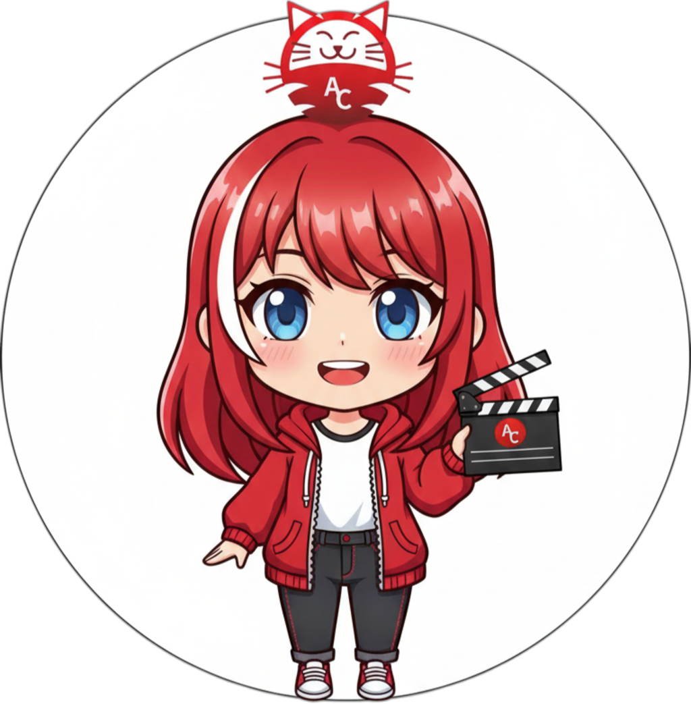
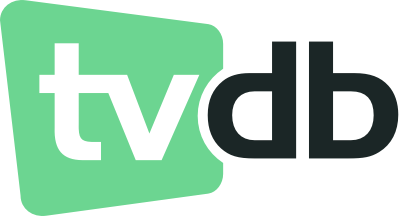

# AnimeClick Metadata per Jellyfin

[](https://github.com/iCosiSenpai/jellyfin-plugin-animeclick/releases/latest) [](https://github.com/iCosiSenpai/jellyfin-plugin-animeclick/actions/workflows/build.yml) [](#installazione) [](LICENSE)

<p align="center">
  
</p>

**Un solo plugin per gli anime in italiano:** titoli, trame, episodi e immagini nella tua libreria Jellyfin, con AnimeClick come prima fonte dei metadati.

[Installa dal catalogo](#dal-catalogo-jellyfin-consigliata) · [Configuralo](#configurazione) · [Segnala un problema](https://github.com/iCosiSenpai/jellyfin-plugin-animeclick/issues)

## Il plugin e le fonti integrate

Nelle librerie dedicate agli anime puoi attivare **AnimeClick come unico provider remoto di metadati e immagini**, dalla versione 1.2. Non servono i plugin separati TMDB, TheTVDB o Fanart per usare queste integrazioni.

| Fonte | A cosa serve | Cosa occorre |
|---|---|---|
| **AnimeClick** | Prima scelta per titoli, trame, generi, tag e altri metadati italiani | Nessuna chiave API |
| **TMDB** | Identificazione delle opere, completamento dei dati mancanti e immagini alla risoluzione originale | [Chiave API TMDB](https://developer.themoviedb.org/docs/getting-started) |
| **Fanart** | Locandine, sfondi anche 4K, loghi, banner e artwork delle stagioni | [Chiave personale Fanart](https://fanart.tv/get-an-api-key/), sufficiente anche da sola |
| **TheTVDB** | Fonte aggiuntiva per titoli e trame | [Chiave API TheTVDB](https://thetvdb.com/dashboard) e opzione **Usa TheTVDB** |
| **Traduzione AI** | Traduzione dei testi disponibili soltanto in inglese | Servizio abilitato, modello scelto e credenziali richieste dal servizio |

I metadati vengono completati **campo per campo**: AnimeClick → altre fonti in italiano → testi inglesi tradotti. Le immagini seguono l'ordine **Fanart → TMDB → locandina AnimeClick**. Le fonti aggiuntive funzionano solo se configurate.

I nomi propri, gli ID e i dati numerici non vengono tradotti. Se manca un dato o l'abbinamento è ambiguo, il campo resta invariato: il plugin non inventa titoli o trame.

## Installazione

**Richiede almeno Jellyfin 12.0 (.NET 10); verificato su Jellyfin 12.0 e 12.1.** Non è compatibile con Jellyfin 10.11. La compatibilità con nuove versioni major va verificata.

### Dal catalogo Jellyfin (consigliata)

1. Apri **Dashboard → Plugin → Repository** e premi **Aggiungi**.
2. Come nome inserisci **iCosiSenpai Plugins** e come URL copia il manifest ufficiale:

   ```text
   https://raw.githubusercontent.com/iCosiSenpai/iCosiSenpai-Plugins/main/manifest.json
   ```

3. Salva, apri **Catalogo** e seleziona **AnimeClick Metadata**.
4. Installa la versione compatibile con il tuo Jellyfin, riavvia il server e apri le impostazioni del plugin.

Questo è il metodo ufficiale e consigliato: Jellyfin gestisce l'installazione e gli aggiornamenti disponibili nel catalogo. Il manifest contiene attualmente la versione 1.0 per Jellyfin 12; le release 1.1 e 1.2 sono disponibili su GitHub ma non sono ancora pubblicate nel catalogo. Le funzionalità descritte qui si riferiscono alla serie 1.2.

### Installazione manuale (alternativa)

Per provare una release non ancora nel catalogo o installare una versione specifica:

1. Scarica `AnimeClick.Plugin.zip` dall'[ultima release](https://github.com/iCosiSenpai/jellyfin-plugin-animeclick/releases/latest).
2. Ferma Jellyfin e conserva una copia della configurazione e del plugin precedente.
3. Sposta le vecchie copie di AnimeClick **fuori dalla directory `plugins`**. Estrai lo ZIP in una sola sottocartella di quella directory.
4. Riavvia Jellyfin e apri le impostazioni del plugin dalla dashboard.

Usa il pacchetto ZIP: contiene il plugin, HtmlAgilityPack, LICENSE e NOTICE. Non copiare le DLL del server dalla cartella di compilazione.

## Configurazione

1. In **Preferenze**, lascia attive **Completa i metadati dalle fonti integrate**, **Immagini TMDB ad alta risoluzione** e, se vuoi usarlo, **Preferisci le immagini Fanart**.
2. In **Fonti aggiuntive**, inserisci la chiave TMDB e le chiavi delle altre fonti desiderate. Per tradurre dall'inglese, abilita il servizio AI, carica il suo elenco di modelli e scegli un modello.
3. Premi **Salva modifiche**.
4. Nelle impostazioni delle **sole librerie anime**, seleziona AnimeClick come unico provider remoto per metadati e immagini di serie, stagioni, episodi e film. Puoi mantenere lettori NFO, immagini locali ed estrattori Jellyfin; gli altri plugin possono restare attivi nelle altre librerie.
5. Controlla l'attivazione dalla pagina **Inizio** e prova un aggiornamento su un singolo titolo.

Senza traduzione AI vengono usati i testi già italiani. Per le serie, Fanart usa l'ID TheTVDB; per i film, l'ID TMDB. Gli ID esterni verificati vengono recuperati dalle integrazioni, senza altri plugin.

L'installazione non avvia una riparazione della libreria. I blocchi dei metadati continuano a essere rispettati; la sostituzione delle immagini esistenti si richiede esplicitamente nel refresh Jellyfin.

## La tua libreria

La pagina analizza i metadati locali **senza modificarli**. Le viste **Titoli episodio** e **Trame e sinossi** mostrano cosa manca; apri una serie per i dettagli e usa **Aggiorna analisi** per rileggere la situazione.

**Sistema tutti i titoli** cerca su AnimeClick e poi nelle fonti configurate. Completa nomi vuoti, generici come “Episodio 12” o derivati dal file e converte i titoli riconoscibilmente inglesi: prima cerca un titolo italiano coerente con quello originale, poi traduce quello inglese della fonte se l’AI è configurata. Se non trova una fonte coerente, può tradurre il titolo inglese già valido, evitando di prendere il titolo di un’altra stagione. Conserva i titoli italiani e quelli dalla lingua incerta. Scrive **solo il nome**, rispettando i campi bloccati e le modifiche manuali intervenute durante la ricerca: numerazione, ID, trame e immagini restano invariati.

Il riquadro **Attività** mostra fase, avanzamento e contatori degli elementi verificati, aggiornati, saltati o in errore. Puoi lasciare la pagina e ritrovare il lavoro in corso, oppure premere **Interrompi**. I refresh delle sinossi già consegnati a Jellyfin possono comunque terminare; lo stato delle attività si azzera al riavvio del server.

L'analisi indica cosa controllare, senza garantire che una fonte abbia il dato. Il recupero conserva la numerazione locale e non assegna i metadati di un singolo episodio ai file che ne contengono più di uno.

## Correggere un abbinamento

Apri **Avanzate → Correggi un abbinamento**, seleziona un film o una serie della libreria e incolla il link alla scheda AnimeClick corretta. Il plugin verifica la scheda, salva l'ID e prosegue l'aggiornamento in background.

Se una stagione ha una scheda AnimeClick distinta, inserisci il suo ID nel campo **AnimeClick** dell'editor metadati della stagione in Jellyfin: avrà precedenza sull'ID della serie per la lista episodi.

## Condividere le correzioni

In **Comunità** trovi due opzioni indipendenti, **entrambe disattivate di default**:

- **Leggere gli abbinamenti approvati**, per riconoscere opere senza un ID AnimeClick già presente.
- **Inviare automaticamente le correzioni manuali**, dopo aver abilitato la condivisione e configurato un token GitHub capace di creare issue nel repository.

Ogni invio crea una **issue pubblica associata al tuo account GitHub**, contenente solo il tipo dell'opera e gli ID AnimeClick/TMDB/TVDB/AniList. Non include file, percorsi, utenti Jellyfin, URL del server o cronologia. Puoi vedere l'anteprima e lo stato degli invii nelle impostazioni.

Il plugin usa soltanto gli abbinamenti revisionati e approvati: migliora il riconoscimento attraverso un dataset condiviso, senza addestrare un modello AI. Disabilitare la condivisione ferma gli invii futuri; le issue già pubblicate restano su GitHub. [Dettagli e revisione delle proposte](community/README.md).

## Problemi e assistenza

| Problema | Cosa controllare |
|---|---|
| Titolo non riconosciuto | Attivazione nella libreria; poi **Avanzate → Correggi un abbinamento** |
| Titoli o trame mancanti | **La tua libreria**, chiavi delle fonti e configurazione della traduzione |
| Un campo non cambia | Blocchi Jellyfin e preferenze del plugin; la riparazione titoli conserva i nomi italiani o dalla lingua incerta |
| Pagina vuota dopo un aggiornamento | Riavvio di Jellyfin, ricaricamento senza cache e assenza di copie duplicate del plugin |

Per [segnalare un problema](https://github.com/iCosiSenpai/jellyfin-plugin-animeclick/issues), indica versione di Jellyfin e del plugin, link AnimeClick, numerazione degli episodi e risultato atteso. Rimuovi chiavi, token e percorsi privati dai log.

Le chiavi vengono salvate nella configurazione amministrativa Jellyfin. La traduzione invia al servizio scelto solo i testi da tradurre, senza file o informazioni sugli utenti, e può avere costi secondo il fornitore.

## Documentazione

[Novità delle versioni](CHANGELOG.md) · [Audit e verifiche 1.2.2](docs/AUDIT-1.2.2.md) · [Procedura di rilascio](docs/RELEASING.md) · [Pipeline di test](.github/workflows/build.yml)

## Copyright, fonti e licenze

### Plugin e identità del progetto

**Copyright (C) 2026 Alessio Cosi (iCosiSenpai).** Il codice è distribuito sotto **[GNU GPL v3](LICENSE)**. Il plugin usa le librerie Jellyfin GPL-3.0-only; chi modifica e distribuisce il codice deve rispettare la stessa licenza e renderne disponibili i sorgenti.

La GPL riguarda il software e non concede diritti sui marchi. Il nome del plugin, il logo, i banner e l'identità **iCosiSenpai** identificano questo progetto: non possono essere usati per presentare un fork come il progetto originale o come una versione approvata dall'autore. I file dell'identità visiva del progetto restano ridistribuibili con il programma secondo la GPL; un fork deve usare un proprio nome e una propria identità visiva. La riserva sui marchi è descritta in **[NOTICE](NOTICE)**, ai sensi della sezione 7(e) della GPLv3.

### AnimeClick e autorizzazione allo scraping

<a href="https://www.animeclick.it/"></a>

I metadati italiani provengono da **[AnimeClick.it](https://www.animeclick.it/)**, gestito dall'associazione culturale senza fini di lucro **[Associazione NewType Media](https://www.antme.it/)**. Il marchio, il logo e i contenuti appartengono ai rispettivi titolari; il plugin non rivendica diritti su di essi e non è affiliato con AnimeClick.

Salvo diversa indicazione, i contenuti redazionali su cui l'associazione possiede i diritti sono distribuiti sotto **[CC BY-NC-ND 4.0](https://creativecommons.org/licenses/by-nc-nd/4.0/)**. Questa licenza non si estende automaticamente a immagini, video, marchi o materiali di terzi: valgono i [termini di AnimeClick](https://www.animeclick.it/termini-di-servizio).

Lo staff AnimeClick ha autorizzato **questo progetto** allo scraping per uso non commerciale. L'autorizzazione è personale e **non trasferibile**: un fork non eredita il consenso e deve ottenere il proprio. Il plugin limita le richieste, usa la cache e non importa i commenti degli utenti come sinossi. Mantieni queste protezioni e non usarlo per raccolte massive o finalità commerciali. I dettagli dell'autorizzazione sono in **[NOTICE](NOTICE)**.

### Provider integrati e piattaforma

I loghi ufficiali sono riportati per identificare le fonti. Marchi, dati e immagini restano soggetti ai diritti dei rispettivi titolari e alle condizioni dei servizi; la licenza del plugin non li rende contenuti GPL.

| Fonte | Attribuzione e condizioni |
|---|---|
| <a href="https://www.themoviedb.org/"></a> | **TMDB / The Movie Database.** This product uses the TMDB API but is not endorsed or certified by TMDB. [Attribuzione e marchio](https://developer.themoviedb.org/docs/faq) · [Termini API](https://www.themoviedb.org/api-terms-of-use) |
| <a href="https://thetvdb.com/"><picture><source media="(prefers-color-scheme: dark)" srcset="assets/providers/thetvdb-dark.png" /></picture></a> | **© 2026 TheTVDB.com®, A Whip Media Company. All rights reserved.** Metadata provided by TheTVDB. Please consider adding missing information or [subscribing](https://thetvdb.com/subscribe). [Attribuzione e condizioni API](https://www.thetvdb.com/api-information) |
| <a href="https://fanart.tv/"></a> | **Fanart.tv.** Artwork provided by Fanart.tv. I diritti sulle immagini restano ai rispettivi titolari. [Condizioni d'uso](https://fanart.tv/terms-and-conditions/) |
| [Jellyfin](https://jellyfin.org/) | **Copyright Jellyfin Contributors.** Piattaforma e librerie `Jellyfin.Controller` / `Jellyfin.Model`, sotto GPL-3.0-only. |

La traduzione AI, se attivata, usa il servizio scelto dall'utente ed è soggetta ai suoi termini. **HtmlAgilityPack** è di **ZZZ Projects Inc.**, sotto licenza MIT; **Microsoft.Extensions.*** usa licenze MIT. Le attribuzioni e il testo MIT della DLL inclusa sono conservati in **[NOTICE](NOTICE)**, distribuito anche nello ZIP del plugin.

Origine dei loghi e condizioni d'uso: **[assets/README.md](assets/README.md)**.

[Buy Me a Coffee](https://buymeacoffee.com/iCosiSenpai) · [PayPal](https://www.paypal.com/donate/?hosted_button_id=5A4E26XC45GLQ)
